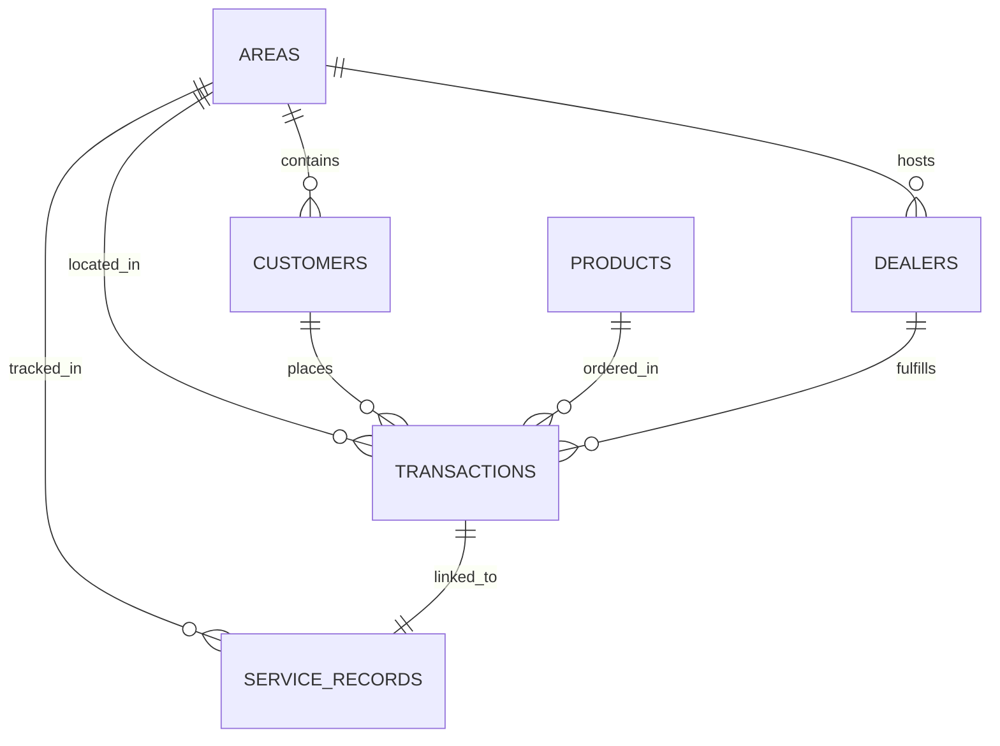

# Complete Technical Documentation

## 1. Project Overview & Business Objective

This project provides an end-to-end **B2B Sales Analytics, Market Penetration, and Opportunity Scoring Pipeline** for an industrial distributor operating across the **Pune Region of Maharashtra, India**. 

The core business objective is to solve the critical strategic question:
> **“Which industrial districts/talukas have the greatest untapped B2B sales potential, and why are underperforming areas failing to meet expectations?”**

The system processes simulated B2B transaction records, customer master data, product catalogues, dealer networks, and service delivery performance metrics to deliver clean data engineering, SQL aggregations, predictive scoring, root-cause diagnostics, and interactive visualizations.

---

## 2. System Architecture

```text
 ┌────────────────────────┐
 │     Simulated Data     │
 │  Areas, Customers,     │
 │  Products, Dealers,    │
 │  Transactions (8.5k),  │
 │  Service Records       │
 └───────────┬────────────┘
             │
             ▼
 ┌────────────────────────┐
 │     Data Cleaning      │
 │  (src/data_cleaning.py)│
 └───────────┬────────────┘
             │
             ▼
 ┌────────────────────────┐
 │   SQLite Relational DB │
 │ (database/schema.sql)  │
 └───────────┬────────────┘
             │
             ▼
 ┌────────────────────────┐      ┌────────────────────────┐
 │ Market Penetration CTE │      │  Root-Cause Engine     │
 │  (src/feature_eng.py)  │      │   (src/root_cause.py)  │
 └───────────┬────────────┘      └───────────┬────────────┘
             │                               │
             └───────────────┬───────────────┘
                             ▼
                 ┌────────────────────────┐
                 │   Opportunity Model    │
                 │(src/opportunity_mod.py)│
                 └───────────┬────────────┘
                             │
                             ▼
                 ┌────────────────────────┐
                 │ Scikit-Learn K-Means   │
                 │   (src/clustering.py)  │
                 └───────────┬────────────┘
                             │
                             ▼
                 ┌────────────────────────┐
                 │ Tableau / Web Export   │
                 │ (dashboard_data.csv)   │
                 └────────────────────────┘
```

---

## 3. Database Schema & Entity Relationships



---

## 4. Opportunity Scoring Methodology

Every area is evaluated on a normalized 0–100 scale across 4 core sub-models:

### 1. Market Potential Score (0–100)
$$
\text{Market Potential} = 0.30(\text{Density}) + 0.25(\text{Market Size}) + 0.20(\text{MIDC}) + 0.15(\text{Growth}) + 0.10(\text{Unit Count})
$$

### 2. Service Performance Score (0–100)
$$
\text{Service Score} = 0.50(100 - \text{Norm Delay Days}) + 0.50(100 - \text{Norm Response Time})
$$

### 3. Penetration Gap
$$
\text{Penetration Gap} = 100 - \text{Current Penetration Rate (\%)}
$$

### 4. Final Composite Opportunity Score
$$
\text{Opportunity Score} = 0.35(\text{Market Potential}) + 0.30(\text{Growth Score}) + 0.20(\text{Penetration Gap}) + 0.15(\text{Service Score})
$$

---

## 5. Machine Learning (Scikit-Learn K-Means)

Unsupervised $K$-Means clustering ($K=4$) is applied to standardized area metrics (`StandardScaler`):
- `industrial_density`
- `estimated_market_size`
- `total_sales`
- `yoy_growth_rate`
- `current_penetration_rate`
- `dealers_per_100_units`
- `avg_delivery_delay_days`

### Resulting Clusters
- **Cluster 0**: Mature Market Leaders (Chakan, PCMC, Bhosari, Ranjangaon, Talegaon, Shirur, Khed, Maval, Baramati)
- **Cluster 3**: Low Potential / Niche Markets (Mulshi, Haveli, Purandar, Daund)
